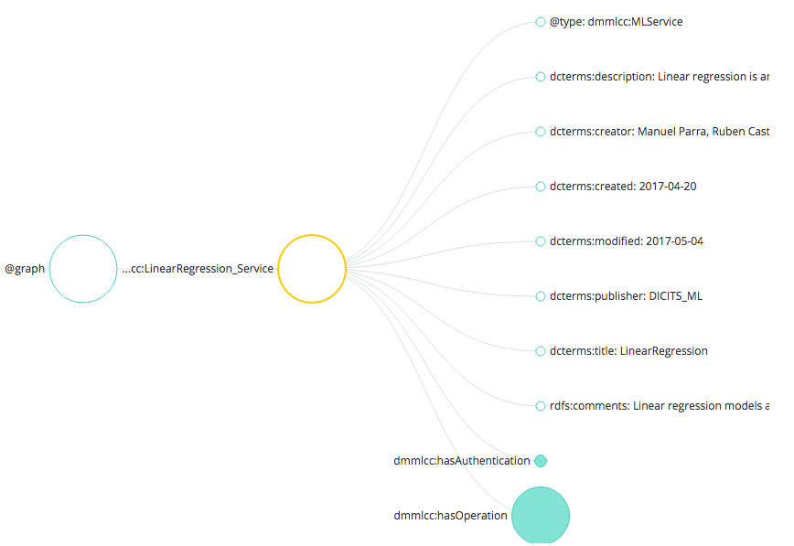

.. OpenCCML documentation master file, created by
   sphinx-quickstart on Tue May 23 00:45:48 2017.
   You can adapt this file completely to your liking, but it should at least
   contain the root `toctree` directive.

Compose services description
============================
 *Created by Manuel Parra, May 2017*

How to compose a service description of a Data Mining / Machine Learning.

Composing the description of a service consists of creating a service definition within a RDF/TURTLE/JSON-LD file.
The description of a data mining service is performed taking into account several parts necessary for the definition of the particular service. These are the following:

* base information of the algorithm,
* authentication,
* input parameters corresponding to the DataSet or characteristics,
* the additional input parameters, ie the operating parameters of the mining method,
* the output of the algorithm / method that can be a model, an evaluation of the model or a DataSet,
* indicate how the method is executed; In this case it is necessary to indicate the type of implementation that is executed, whenever possible.


Each of these elements listed above has a concrete set of attributes. These attributes are indicated with a specific and specific terminology of each of   the service definition languages that are used. In our case we will use two types of definition of comma services or service definition languages on the one hand Turtle files and another JSON-LD. Let's start defining a service with the definition language JSON-LD.


Composing with JSON-LD
----------------------

**What's JSON-LD**

JSON-LD is a lightweight Linked Data format. It is easy for humans to read and write. It is based on the already successful JSON format and provides a way to help JSON data interoperate at Web-scale. JSON-LD is an ideal data format for programming environments, REST Web services, and unstructured databases such as CouchDB and MongoDB.

More info: https://json-ld.org/

**JSON-LD and service definition**

Each of the service definition languages initially has a context that corresponds to the vocabulary that will be used within the service definition file. This context allows to use vocabularies
  Specific, for example names of attributes or characteristics of that vocabulary; A concrete example would be, for example, how to define a date type attribute, in this case the dcterms: created attribute: "2017-03-12" would be used. You can also define more attributes equivalent to this from other vocabularies and are still fully compatible.


Base Information
~~~~~~~~~~~~~~~~

This is at the main level of the ``graph`` and contains the following attributes::
 
	"@graph":  [ {
		"@id": "dmmlcc:LinearRegression_Service",
		"@type": "dmmlcc:MLService",
		"dcterms:description": "Linear regression is an approach for modeling the relationship between a scalar dependent variable y and one or more explanatory variables (or independent variables) denoted X. The case of one explanatory variable is called simple linear regression.",
		"dcterms:creator":"Manuel Parra, Ruben Castro, J. Antonio Cortes",
		"dcterms:created":"2017-04-20",
		"dcterms:modified":"2017-05-04",
		"dcterms:publisher":"DICITS_ML",
		"dcterms:title":"LinearRegression",
		"rdfs:comments":"Linear regression models are often fitted using the least squares approach, but they may also be fitted in other ways, such as by minimizing the 'lack of fit' in some other norm (as with least absolute deviations regression), or by minimizing a penalized version of the least squares loss function as in ridge regression",
		"dmmlcc:hasAuthentication": {...},
		"dmmlcc:hasOperation": {...}
	}]
  
  
And this is the equivalent figure og the code:


   

Authentication for the service
~~~~~~~~~~~~~~~~~~~~~~~~~~~~~~

If the service requires authentication, the parameters must be indicated. This is done filling the ``"dmmlcc:hasAuthentication"`` attribute as follows::


		"dmmlcc:hasAuthentication": {
		
			"@id": "dmmlcc:LinearRegression_Service_Auth",
			"@type": "dmmlcc:MLServiceAuthentication",
		 	"dcterms:description": "The service requires authentication, and the type of authentication",
			"waa:requiresAuthentication":"None"
		},

Operations in the service
~~~~~~~~~~~~~~~~~~~~~~~~~

The service operations section contains much of the service definition. Among them is the data entry and characteristics, also the input parameters of the algorithm such as for a logistic regression, parameters such as the type of formula, what to do with nulls, weights, etc. It includes the output of the algorithm that can be a model, an evaluated model, or a DataSet (according to operations such as processing). Finally, it includes execution data, such as the implementation to be used of the algorithm, the package and the exact function.

This is the general structure of operations ``"dmmlcc:hasOperation``::


	"dmmlcc:hasOperation": {
		"mls:hasInput":{ ... },
		"dmmlcc:hasInputParameters":{ ... },
		"mls:hasOutput":{ ... },
		"mls:executes":{ ... }
	}
	
	
Within each of these sections as ``hasInput``, ``hasInputParameters``, ``output`` and ``execution``, contains different attributes and characteristics that identify them.

Operation: hasInput
~~~~~~~~~~~~~~~~~~~

To indicate that the service requires a data entry it is necessary to compose this entry as follows. The entry has a property that contains what data it will receive. This entry can be of two types, DataSet or Features::


	"mls:hasInput":
		{
		"@id": "dmmlcc:LinearRegression_Service_Input",
		"@type": "dmmlcc:MLServiceInput",
		"dcterms:title":"InputDataSet",
		"dcterms:description": "Input data contains Dataset or Feature/s",
		"dmmlcc:contains":{
			"@id":"dmmlcc:contains_dataset_01",
			"@type:":"dmmlcc:contains",
			"mls:Data":[
				{
				"@id":"dmmlcc:dataset_01",
				"@type:":"mls:DataSet",
				"dcterms:title": "DataSet",
				"dcterms:description": "Dataset on which the service is applied",
				"dmmlcc:storagebucket":"dicits://",
				"dmmlcc:mandatory":"true"									
				"dmmlcc:format":
					{
					"@id":"dmmlcc:ParameterFormat_CVS_00",
					"@type": "dmmlcc:csv",
					"dcterms:description": "CSV Source file format"						
					},
				}
			]
			}
		},
		

If the type is a DataSet just as if it is a feature needs to be identified by the file format that contains the data. In this example the dataset is a CSV.

In the case where the algorithm has an entry corresponding to a column or vector of a DataSet, it would only be necessary to indicate the feature or features that will form the input of the algorithm. 

Features are usually used when algorithms receive a column or vector  to process and return the same column or columns with some transformations. That is, for preprocessing algorithms for example.::


	"mls:hasInput":{
		...
		"dmmlcc:contains":{
			"@id":"dmmlcc:contains_features",
			"@type:":"dmmlcc:contains",
			"mls:Data":[						
					{
					"@id":"dmmlcc:Feature_00",
					"@type:":"mls:Feature",
					"dcterms:description": "Feature",
					"dcterms:title": "Feature",
				 	"dcterms:description": "Individual Feature",
					"dmmlcc:storagebucket":"dicits://",
					"dmmlcc:mandatory":"true"				
					"dmmlcc:format":
						{
							"@id":"dmmlcc:ParameterFormat_CVS",
							"@type": "dmmlcc:csv",
							"dcterms:description": "CSV Source file format"									
						},
				},
				{
					"@id":"dmmlcc:Feature_01",
					"dcterms:description": "Feature Y",
					"dcterms:title": "Feature",
				 	"dcterms:description": "Individual Feature",
					"dmmlcc:storagebucket":"dicits://",
					"dmmlcc:mandatory":"true"
					"dmmlcc:format":
						{
							"@id":"dmmlcc:ParameterFormat_CVS",
							"@type": "dmmlcc:csv",
							"dcterms:description": "CSV Source file format"									
						},
				}
			]					
		}
	}


Operation: hasInputParameters
~~~~~~~~~~~~~~~~~~~~~~~~~~~~~

The input parameters correspond to all those characteristics necessary for the algorithm to be executed. It shares all those parameters that the function or algorithm requires. For example in a linear regression, it would be anything that is not the dataset ie. modifiers associated with the function like  associated weights or the type of regression and so on::


	"dmmlcc:hasInputParameters":
	{	
		"@id": "dmmlcc:LinearRegression_Service_InputParameters",
		"@type": "dmmlcc:MLServiceInputParameters",
		"dcterms:description": "Input Parameters",
		"dcterms:title": "Input",
		"dmmlcc:Parameters":[
			{
				"@id":"dmmlcc:response_parameter_01",
				"@type": "dmmlcc:MLServiceInputParameter",
				"dcterms:title": "formula",
				"dcterms:description": "Response variable and Formulae ",
				"dmmlcc:mandatory":"true",
				"dmmlcc:defaultvalue":""						
			},
			{
				"@id":"dmmlcc:response_parameter_02",
				"@type": "dmmlcc:MLServiceInputParameter",
				"dcterms:title": "subset",
				"dcterms:description": "Optional vector specifying a subset of observations to be used in the fitting process",
				"dmmlcc:mandatory":"optional",	
				"dmmlcc:defaultvalue":"NULL"
									
			},
			{
				"@id":"dmmlcc:response_parameter_03",
				"@type": "dmmlcc:MLServiceInputParameter",
				"dcterms:title": "na.action",
				"dcterms:description": "A function which indicates what should happen when the data contain NAs",
				"dmmlcc:mandatory":"optional",
				"dmmlcc:defaultvalue":"na.remove"
										
			},
			{
				"@id":"dmmlcc:response_parameter_04",
				"@type": "dmmlcc:MLServiceInputParameter",
				"dcterms:title": "weights",
				"dcterms:description": "Optional vector of weights to be used in the fitting process. If non-NULL, weighted least squares is used with weights weights (that is, minimizing sum(w*e^2)); otherwise ordinary least squares is used",
				"dmmlcc:mandatory":"optional",
				"dmmlcc:defaultvalue":"NULL"
										
			}
		]			
	}
			

Operation: hasOutput
~~~~~~~~~~~~~~~~~~~~

The output of the algorithm must be fully specified. There are three possible output types that are the model, the evaluation of the model or a DataSet. The model corresponds to the output of the execution of the algorithm, ie the model generated by the function. The evaluation of the model corresponds to the extraction of the individual parameters of the model. The model generated by a function must be exported PMML instead the model evaluated corresponds to the set of attributes contained in the model. In reference to DataSet as a result of the output of the section of an algorithm, this corresponds to operations performed by the algorithm for a pre-processing or modification of an input DataSet.


This option ``hasOutput`` can be composed using the following structure::


	"mls:hasOutput":{
		"@id": "dmmlcc:LinearRegression_Service_Output",
		"@type": "dmmlcc:MLServiceOutput",
		"dcterms:description": "Output of the service contains Model or ModelEvaluation or Data",
		"mls:Model":{
			"@id":"dmmlcc:LinearRegression_Model",
			"@type": "dmmlcc:PMML_Model",
			"dcterms:title": "PMML Model related",
			"dcterms:description": "PMML model to represent mining models",
			"dmmlcc:storagebucket":"dicits://models/"
		},
		"mls:ModelEvaluation":{
			"@id":"dmmlcc:LinearRegression_ModelEvaluation",
			"@type": "dmmlcc:ModelEvaluation",
			"dcterms:title": "Model evaluation",
			"dcterms:description": "Model Evaluation",
			"dmmlcc:storagebucket":"dicits://modelevaluation/"
		}				
	},


Model and ModelEvaluation should always be together in the output of this type. The output can be Model and ModelEvaluation for algorithms that generate a model. For a DataSet the following code will be performed: ::

	"mls:hasOutput":{
		"@id": "dmmlcc:Correlation_Service_Output",
		"@type": "dmmlcc:MLServiceOutput",
		"dcterms:description": "Output of the service contains Model or ModelEvaluation or Data",				
		"mls:ModelEvaluation":{
			"@id":"dmmlcc:Correlation_ModelEvaluation",
			"@type": "dmmlcc:ModelEvaluation",
			"dcterms:title": "Model evaluation",
			"dcterms:description": "Model Evaluation",
			"dmmlcc:storagebucket":"dicits://modelevaluation/"
		}
	},


Operation: executes
~~~~~~~~~~~~~~~~~~~

The implementation (execution function) of the algorithms must also be fully specified. It is important that the selection of the implementation will be  adequate to execute the Algorithm and the Features. The implementation should include the package (if it exists) and the corresponding function that solves (executes) the algorithm such that to detail the execution of an implementation you must indicate the source of the implementation (Python, R, Scala, ...) , the package and the function/s to be executed.

For example, for a ``Linear Regression`` service to run in ``R``, it is necessary to indicate::

	"dmmlcc: ImplementationSource": "R",
	"dmmlcc: package": "core",
	"dmmlcc: functions": ["lm"]
	
Where ``dmmlcc: ImplementationSource``` indicates the support of the algorithm, ``dmmlcc: package`` corresponds to the container package of the function to be executed and ``"dmmlcc: functions"`` select the specific method of the package to be executed in this implementation.

In execution you can have multiple implementations, as many as languages ​​and variants of functions exist.

A full example for ``Linear Regression`` in ``R`` and ``lm`` R function enabled to be executed at the entrypoint of the service ::

	"mls:executes":{
		"@id": "mls:LinearRegression_Implementation",
		"@type": "mls:Implementation",
		"dcterms:description": "Implementation of Linear Regression Model",
		"dmmlcc:implements":[
			{
				"@id":"dmmlcc:MLAlgorithm_01",
				"@type":"mls:Algorithm",
				"dcterms:description": "Linear Regression Algorithm in R",
				"dmmlcc:ImplementationSource":"R",
				"dmmlcc:package":"core",
				"dmmlcc:functions":["lm"]
			}
		]
	}

If you want to describe execution of ``Linear Regression`` in ``Spark+R`` the following code must be included in your description::


	"mls:executes":{
		"@id": "mls:LinearRegression_Implementation",
		"@type": "mls:Implementation",
		"dcterms:description": "Implementation of Linear Regression Model",
		"dmmlcc:implements":[
			{
				"@id":"dmmlcc:MLAlgorithm_01",
				"@type":"mls:Algorithm",
				"dcterms:description": "Linear Regression Algorithm in R",
				"dmmlcc:ImplementationSource":"R",
				"dmmlcc:package":"core",
				"dmmlcc:functions":["lm"]
			},
			{
				"@id":"dmmlcc:MLAlgorithm_02",
				"@type":"mls:Algorithm",
				"dcterms:description": "Linear Regression Algorithm in Spark+R",
				"dmmlcc:ImplementationSource":"SparkR",
				"dmmlcc:package":"core",
				"dmmlcc:functions":["lm"]
			},
		]
	}


Starting from a template
------------------------

Another way to build and define a service can be done using existing service definitions. In the project folder ``/services_definition/`` you can review all descriptions of data mining and machine learning services available for OpenCCML. They are available in two formats ``Turtle`` and ``JSON-LD``. Both formats are understood by OpenCCML and therefore you can define your service with any of them.

To start working from a service description template already created, we recommend using a simple algorithm or method such as simple data processing operations, for example a ``corelation``.

